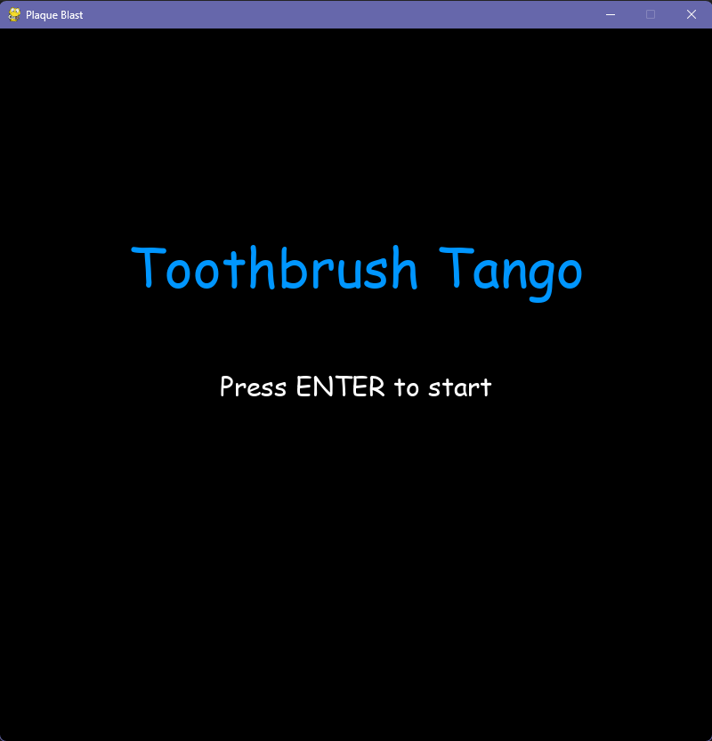
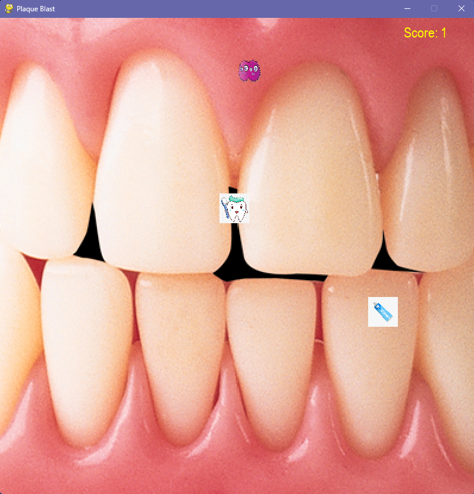
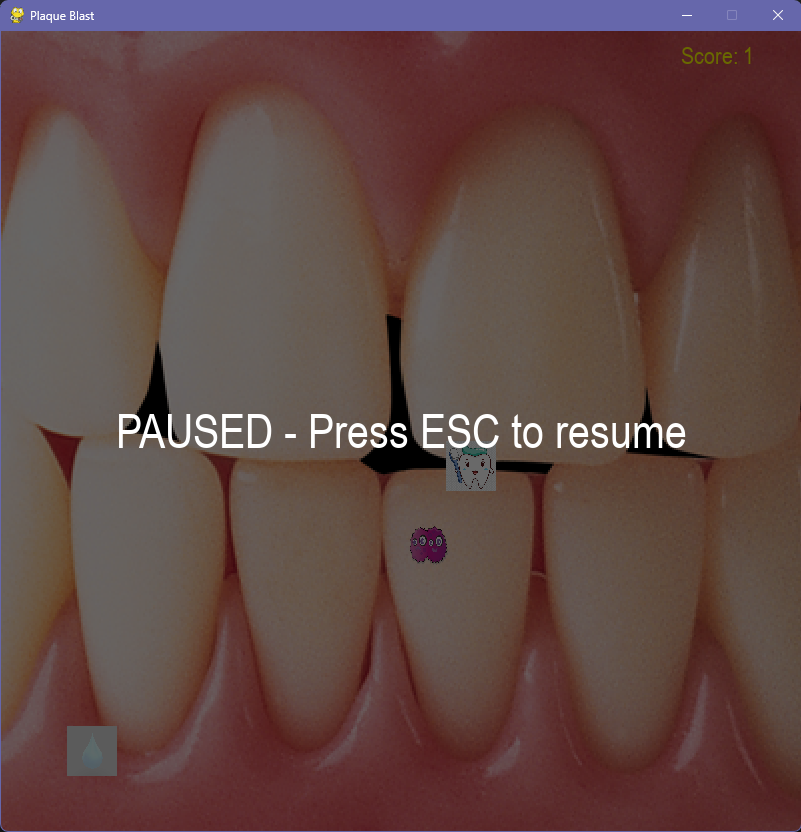
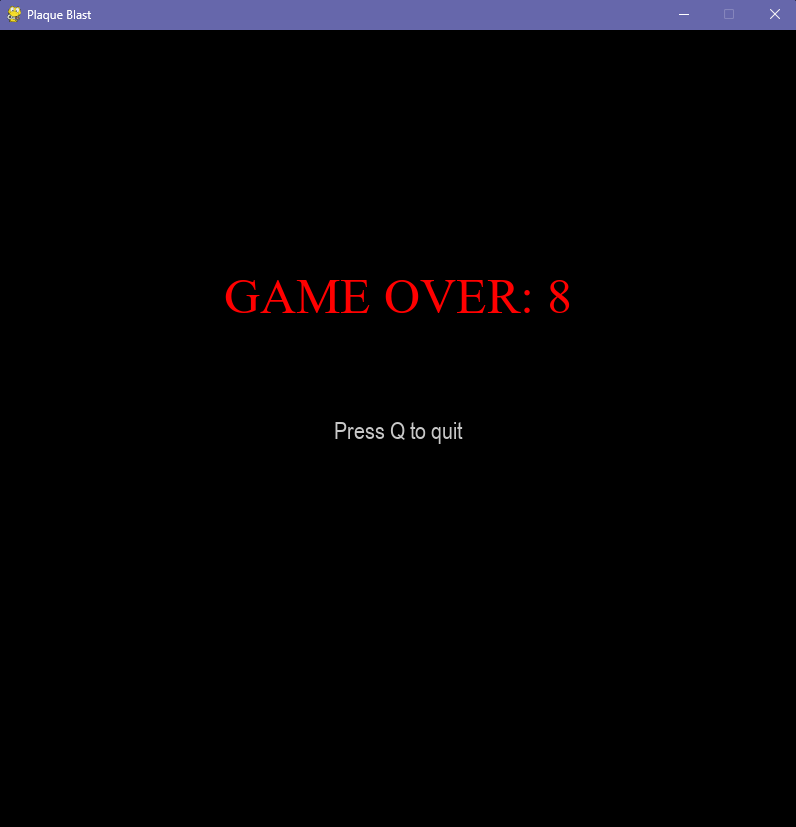

# Toothbrush Tango 🪥 (Plaque Blast)

---

Toothbrush Tango is a Pygame arcade survival game where you play as a toothbrush collecting sanitary products (toothpaste, soap, water, etc.) while dodging a germ that gets faster the more you collect.

Every pickup increases your score — and powers up the germ — so the longer you last, the more intense the chase becomes.

---

## Gameplay
- **You are the toothbrush** (player).
- **Collect sanitary items** (resources) to increase your score.
- **Avoid the germ** (enemy). Touching it ends the game.
- Each time you collect an item, the germ becomes **10% faster**, making survival harder over time.

---

## Controls
- **Arrow Keys**: Move (Left / Right / Up / Down) 
- **ESC**: Pause / Resume
- **Q**: Quit from the game-over screen (or trigger game over during gameplay)
- **ENTER**: Start from the title screen

---

## Features
- Title screen (“Press ENTER to start”)
- Score HUD (top-right) 
- Pause overlay (ESC toggles pause)
- Randomized collectible spawns
- Collectibles swap between multiple sanitary item sprites each time they respawn
- Enemy movement includes bouncing + random patrol changes after each pickup
- Progressive difficulty: enemy speed increases by **10% per collected item** 

---

## Requirements
- Python 3.x
- Pygame

---

Install Pygame:
```bash
pip install pygame
```
```bash
python Main.py
```
---

## Screenshots






